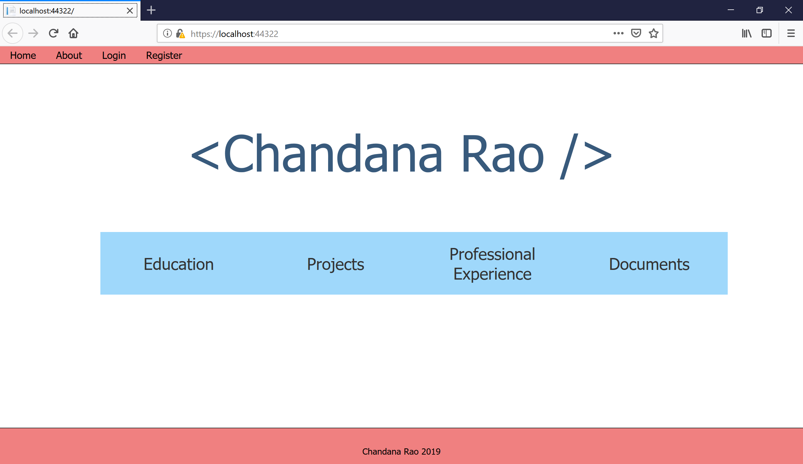
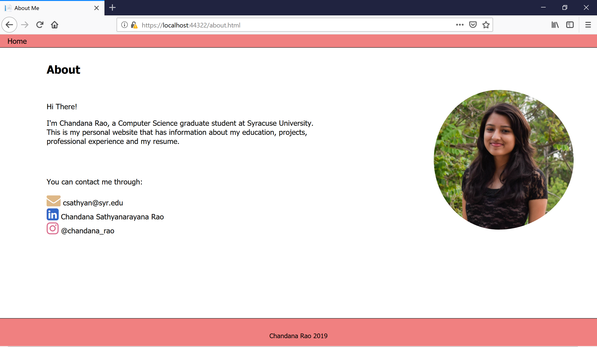
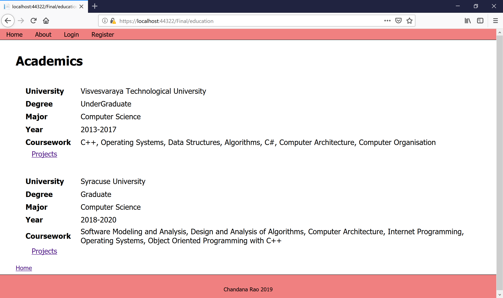
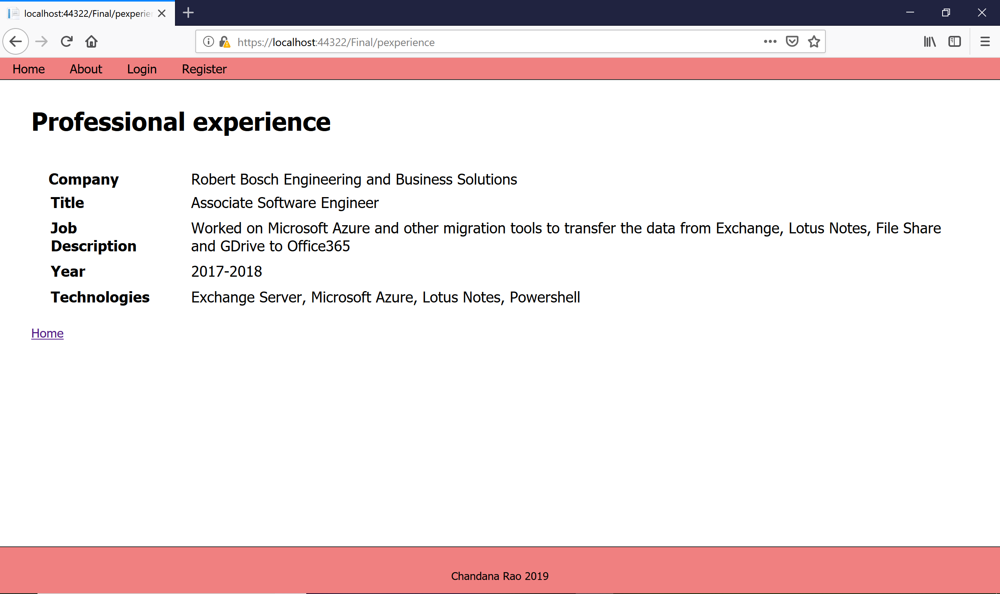
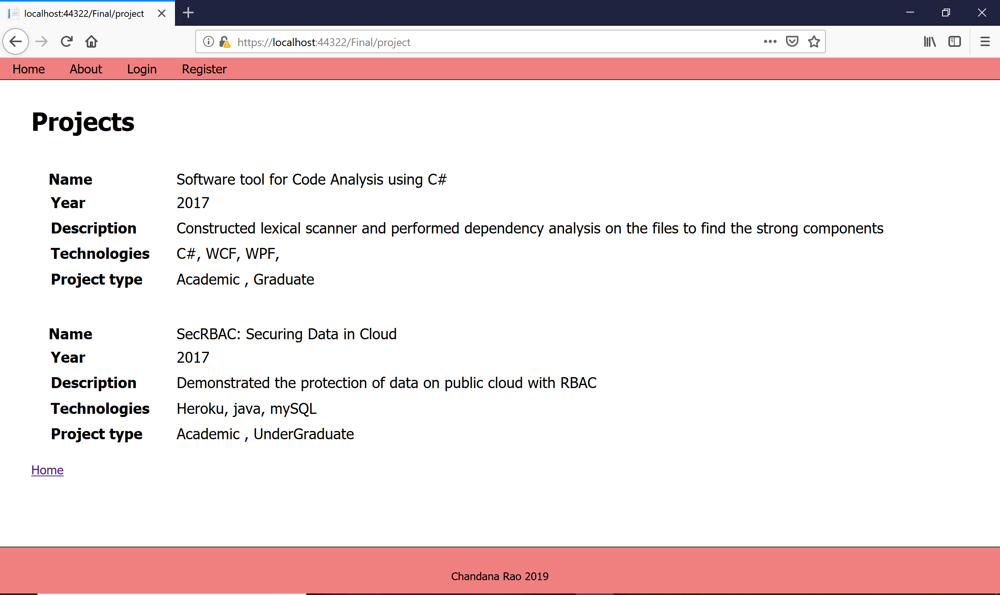

This website is developed with html, css and javascript, and on ASP .NET.
It is a personal website that gives the information about my educational background, professional experience and the projects.
With the password protected section, the users(aimed for recruiters) can login/signup to give a feedback on the site or schedule the interview.
Built web APIs to upload/download/delete the files from the admin side.

